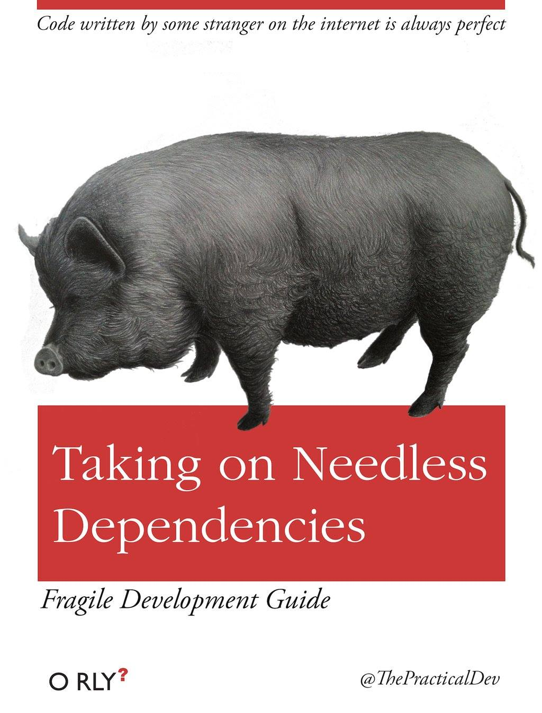
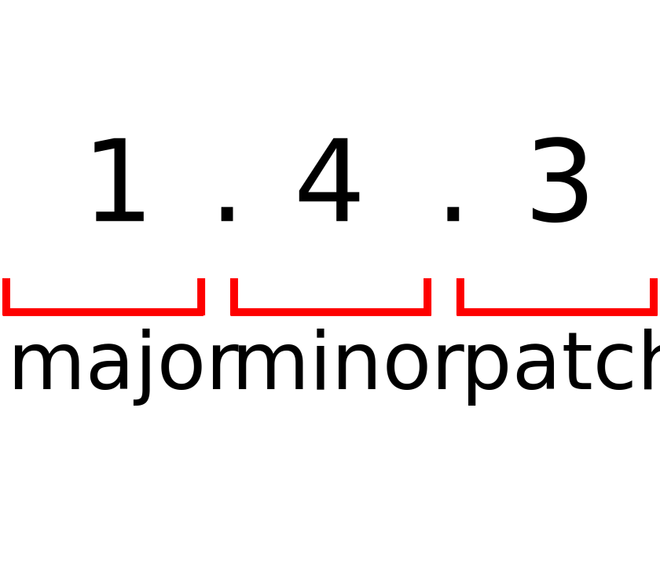

---

layout: yandex2

style: |
    .slide img {
        background-color: transparent !important;
    }
    
    .fullscreen img {
        width: 100%;
        height: 100%;
        max-height: 1080px;
        max-width: 1920px;
        object-fit: contain;
    }
    
    
---

# {:.logo}

## зависимости
{:.fullscreen}


<!-- Не один крупный проект не может обойтись без внешних библиотек и зависимостей.
Давайте поговорим о том, как правильно управлять ими -->

## Прямо в HTML

```html
<script 
    src="https://ajax.googleapis.com/ajax/libs/jquery/3.2.1/jquery.min.js">
</script>
<link 
    rel="stylesheet" 
    href="https://maxcdn.bootstrapcdn.com/bootstrap/3.3.7/css/bootstrap.min.css">
<script 
    src="https://maxcdn.bootstrapcdn.com/bootstrap/3.3.7/js/bootstrap.min.js">
</script>
```

<!-- Конечно, можно просто подключить нкжные библиотеки прямо в код страницы
Чем это плохо? Не пригодно, если вы сами делаете подключаемую библиоткеу, 
сложно отслеживать обновления, 
зависимость от внешних условий

примелимо для демо страничек или прототипов
-->

## Менеджеры пакетов фронтенда
{:.images .two}

<!-- Для решения таких задач используют пакетные системы
Состоят из :
реестра пакетов - хранилищие списка пакетов и самого их кода
пакетного менеджера - утилиты, которая позволяет устанавливать пакеты из реестра

Исторически используются в nix-мире (например debian-пакеты их менеджер apt)
существуют для многих языков (pip для python, gem для ruby и т.д.)
Для js самые популярные - bower и npm 

bower создавался для фронтенда 
npm - Node Package Manager - изначально для бек-энда и node.js, сейчас и для фронта
npm де-факто победившая технология
 -->


Bower


npm

## Semantic Versioning
<!-- Пакеты необходимо версионировать, так как могут быть изменения, 
вносящие баги или ломающие обратную совместимость - 
если всегда грузить полседнюю версию, все может разломаться

Человечество придумало semver - мажор.минор.патч блаблабла
-->

{:.image-left}

**Мажорная версия**
Изменения, которые ломают обратную совместимость
{:.next}

**Минорная версия**
Изменения, которые добавляют функциональность с сохранением обратной совместимости
{:.next}

**Патч-версия**
Исправления багов без добавления новой функциональности
{:.next}

## Фиксирование версий
Необходимо, чтобы обновления зависимостей не сломали ваше приложение.
{:.next}
<!-- как фиксировать версии ? -->
`"react": "*", // поставит последнюю достпную версию react`
{:.next}
`"react": "^15.6.1", // поставит последнюю доступную версию react 15.x.x`
{:.next}
`"react": "~15.6.1", // поставит последнюю доступную версию react 15.6.x`
{:.next}
`"react": "15.6.1", // поставит react 15.6.1`
{:.next}

## Фиксирование версий - lock-файлы

<!-- новый менеджер пакетов от Facebook yarn -
 очень быстрый (за счет продуманного кеширование)
 из коробки создает yarn.lock - полное описание дерева зависимостей
 нужно для полной повторяемости сборки
 изменятеся при добавлении новых пакетов через команды yarn
 
 Cледом подтянулся npm v5 с похожим механизмом -  package-lock.json
 
 тут можно показать работу йарна с лофайлом
 -->
```shell
$ yarn
yarn install v0.23.3
info No lockfile found.
[1/4] 🔍  Resolving packages...
[2/4] 🚚  Fetching packages...
[3/4] 🔗  Linking dependencies...
[4/4] 📃  Building fresh packages...
success Saved lockfile.
✨  Done in 17.71s.
```
 
## Фиксирование версий - lock-файлы

```shell
$ yarn
yarn install v0.23.3
[1/4] 🔍  Resolving packages...
success Already up-to-date.
✨  Done in 0.58s.
```

## Протухание зависимостей
{:.fullscreen}

<!-- Если периодически не отслеживать обновления ваших зависимостей,
их может накопиться столько, что обновление всех пакетов разом будет очень болезненным
(много ломающих изменений и т.д.)-->

## Следим за обновлениями
- npm-check-updates
    - проверяет обновление npm-зависимостей из package.json
{:.next}
- updtr
    - проверяет обновление npm-зависимостей из package.json
    - при обновлении каждой зависимосте прогоняет `npm test` и сообщает о тех зависимостях, которые ломают тесты
{:.next}

## Следим за обновлениями
- next-update
    - умеет отслеживать зависимости из git-репозиториев
    - полезен для npm-пакетов - умеет проверять, не сломает ли ваше обновление пакеты, которые зависят от вашего
{:.next}
- greenkeeper.io
    - все то же самое, но в виде сервиса, подключающегося к вашему github-репозиторию, и отправляющее пулл-реквесты с обновлениями
{:.next}

## Ссылки
- [semver.org](semver.org)
- [http://blog.js-republic.com/keep-npm-dependencies-up-to-date/](http://blog.js-republic.com/keep-npm-dependencies-up-to-date/)
- [greenkeeper.io](greenkeeper.io)
