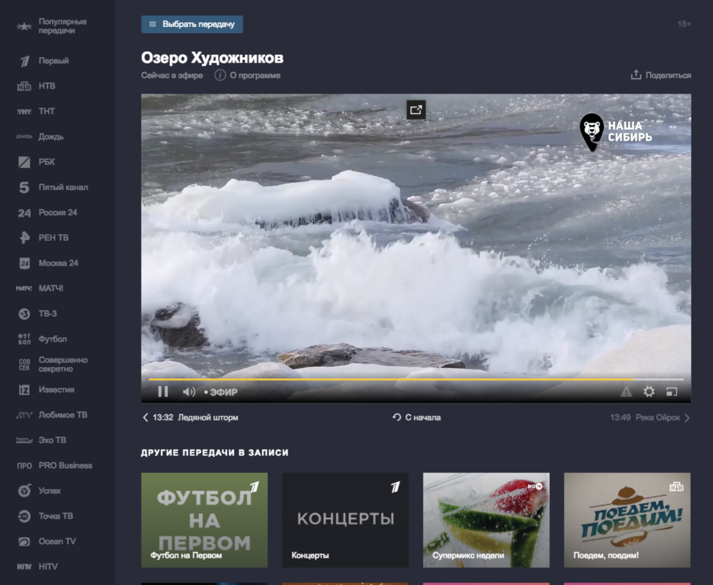
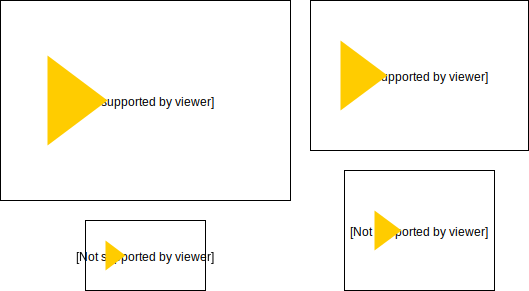
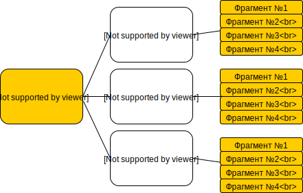
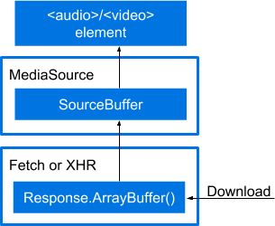
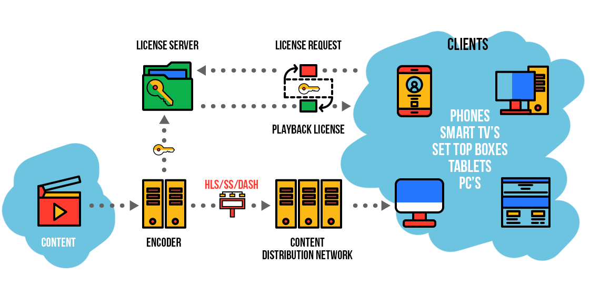
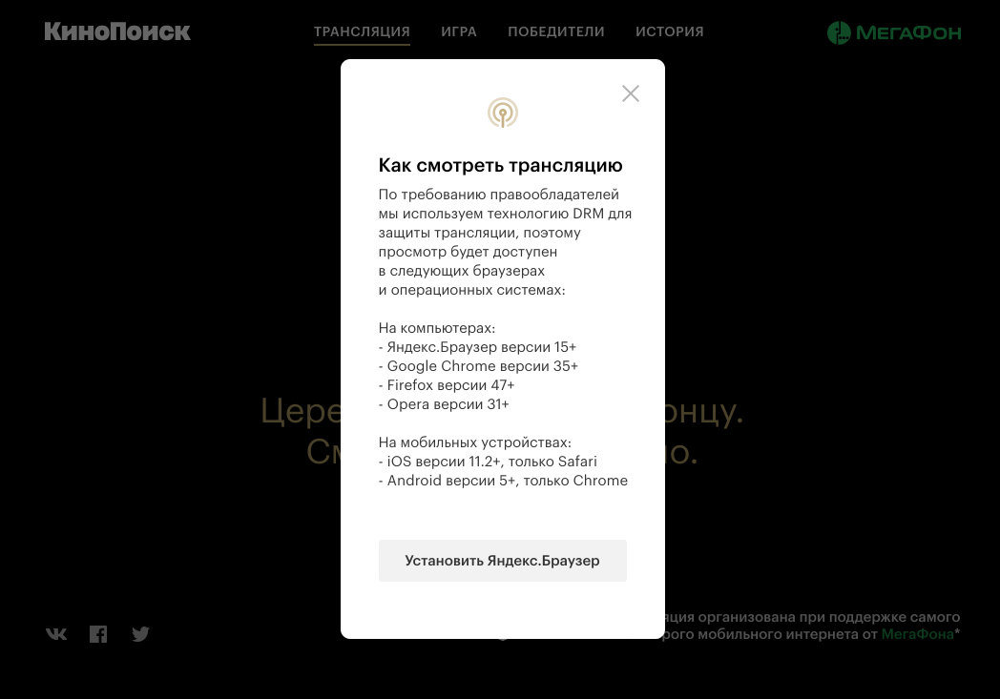

---

layout: yandex2

style: |
    .slide img {
        background-color: transparent !important;
    }

    .fullscreen img {
        width: 100%;
        height: 100%;
        max-height: 1080px;
        max-width: 1920px;
        object-fit: contain;
    }

    .language-m3u8 {
        background: rgba(88, 90, 94, .1) !important;
    }
---

# {{ site.presentation.title }}
{:.title}

### {{ site.presentation.service }}



{:.nda}


<div class="authors">

<p>{{ site.author.name }}, {{ site.author.position }}</p>



<p>{{ site.author2.name }}, {{ site.author2.position }}</p>


</div>

## Видео в Яндексе
{:.fullscreen}
<div style="display: flex; justify-content: center; height: 100%; background: black">

</div>


## Содержание
* Применение
* Форматы видео
* API и особенности
* Адаптивное видео и live-трансляции
* Защита контента

## Введение
{:.section}

## Немного истории
* Flash
* Silverlight
* Java Applet
* Встриваемые плагины плееров <br> (QuickTime, Windows Media Player и т.д.)

## HTML5 Media Elements

```html
<video>
<audio>
```

<table>
 <tbody>
  <tr>
   <th></th>
   <th>Chrome</th>
   <th>Firefox (Gecko)</th>
   <th>Internet Explorer</th>
   <th>Safari</th>
  </tr>
  <tr>
   <td>Базовая<br>поддержка</td>
   <td>3.0+</td>
   <td>3.5+</td>
   <td>9.0+</td>
   <td>3.1+</td>
  </tr>

 </tbody>
</table>

### https://developer.mozilla.org/ru/docs/Web/HTML/Element/video

## Применение
* отображение видео-роликов в браузере
* анимации и дизайн
* WebGL и HTML5 Canvas

## Отображение видео-роликов в браузере
* встроенные контролы - `<video controls ...></video>`
* собственный скин и управление видео-тегом через API

<div style="display: flex; height: 65%; justify-content: space-around">
<iframe scrolling="no" allowfullscreen="" gesture="media" allow="autoplay; encrypted-media" src="https://yastatic.net/yandex-video-player-iframe-api-bundles/1.0-354/index.html?mq_url=https%3A%2F%2Fstrm.yandex.ru%2Fkal%2Fohotnik%2Fohotnik0.m3u8&volume=0&muted=true&autoplay=true&report=false&report_url=https%3A%2F%2Fyandex.ru%2Fsupport%2Fteletranslation%2Fform.html&preview=&host=pcode-ci.s3.mds.yandex.net&additional_params=%7B%22from%22%3A%22other%22%2C%22vsid%22%3A%2271488b333da804dcbb6db3e9d76b919a6b6425e5b5154e489e9899d2b87c852c%22%7D&vsid=71488b333da804dcbb6db3e9d76b919a6b6425e5b5154e489e9899d2b87c852c" style="border-width: 0px; display: block; width: 45%; height: 100%;"></iframe>
<video loop preload="auto" muted controls
    src="https://automatic-bottle.surge.sh/kitten_fighting.webm?id=0"
    style="width: 45%; height: 100%; display: inline-block; background: black"
></video>
</div>


## Анимации

<video autoplay muted style="width: 100%; height: 80%; background: black;" src="oscar.webm">
</video>
### https://www.kinopoisk.ru/special/oscar/

## GIF vs WEBM
<div style="display: flex; justify-content: space-around">
    <video loop autoplay muted
        src="https://automatic-bottle.surge.sh/kitten_fighting.webm?id=1"
        style="width: 40%; height: auto; display: inline-block"
    ></video>
    
</div>

* gif - 6.6mb
* webm - 478kb

### https://www.sohamkamani.com/blog/2016/04/09/stop-using-gifs/

## Форматы видео
{:.section}

## Форматы видео в HTML5
{:.images}


## Кодеки и контейнеры

<div style="display: flex; justify-content: center; align-items: center; height: 75%;">
<table style="width: 80%;">
    <tr>
        <th colspan="3">Видео-контейнер (файл)</th>
    </tr>
    <tr>
        <td rowspan="3"  style="vertical-align: middle;">
            Видео-поток
        </td>
        <td>Аудио-поток #1</td>
        <td>Дорожка субтиров #1</td>
    </tr>
    <tr>
        <td>Аудио-поток #2</td>
        <td>Дорожка субтиров #2</td>
    </tr>
    <tr>
        <td>Аудио-поток #3</td>
        <td>Дорожка субтиров #3</td>
    </tr>
</table>
</div>

## Кодеки и контейнеры
<div style="display: flex; justify-content: center; align-items: center; height: 75%;">
<table>
    <tr>
        <td>Контейнер</td>
        <td>Поддерживаемые кодеки</td>
    </tr>
    <tr>
        <td>.webm</td>
        <td>VP8/VP9 (видео) +<br> Vorbis/Opus (аудио)</td>
    </tr>
    <tr>
        <td>.ogg</td>
        <td>Theora (видео) + Vorbis (аудио)</td>
    </tr>
    <tr>
        <td>.mp4</td>
        <td>H.264 (видео) + AAC/MP3 (аудио)</td>
    </tr>
</table>
</div>

## Поддержка

<table>
 <tbody>
  <tr>
   <th>Feature</th>
   <th>Chrome</th>
   <th>Firefox (Gecko)</th>
   <th>Internet Explorer</th>
   <th>Safari</th>
  </tr>
  <tr>
   <td>VP8/Vorbis (WebM)</td>
   <td>6.0</td>
   <td>4.0</td>
   <td>9.0</td>
   <td>3.1</td>
  </tr>
  <tr>
   <td>VP9/Opus (WebM)</td>
   <td>29.0</td>
   <td>28.0</td>
   <td><span style="color: #f00;">-</span></td>
   <td><span style="color: #f00;">-</span></td>
  </tr>
  <tr>
   <td>Theora/Vorbis (Ogg)</td>
   <td><span style="color: #888;">+</span></td>
   <td>3.5</td>
   <td><span style="color: #f00;">-</span></td>
   <td><span style="color: #f00;">-</span></td>
  </tr>
  <tr>
   <td>H.264/MP3 (MP4)</td>
   <td><span style="color: #888;">+</span></td>
   <td><span style="color: #888;">+</span></td>
   <td>9.0</td>
   <td><span style="color: #888;">+</span></td>
  </tr>
  <tr>
   <td>H.264/AAC(MP4)</td>
   <td><span style="color: #888;">+</span></td>
   <td><span style="color: #888;">+</span></td>
   <td><span style="color: #888;">+</span></td>
   <td>3.1</td>
  </tr>
 </tbody>
</table>

## API video-элемента и особенности использования
{:.section}

## Вставка video-элемента
```html


<video src="video.webm"></video>

<video width="400" controls>
  <source src="video.mp4" type="video/mp4">
  <source src="video.ogg" type="video/ogg">
</video>
```

## Проверка поддержки формата в браузере
```javascript
video.canPlayType(mimeType)
// mimeType - "video/mp4", "video/webm",
// "video/webm; codecs="vp8.0, vorbis""
```

* ``'probably'`` - видео скорее всего проиграется
* `'maybe'` - нельзя точно установить, проиграется ли видео без попытки запуска
* `''` (пустая строка) - не поддерждивается


## API - HTMLMediaElement
HTMLVideoElement и HTMLAudioElement наследуют от общего интерфейса

HTMLMediaElement

<a href="https://dev.w3.org/html5/spec-preview/media-elements.html">
https://dev.w3.org/html5/spec-preview/media-elements.html
</a>

## preload
* `'auto'`
* `'metadata'`
* `'none'`

<div style="display: flex; height: 55%; justify-content: space-around">
<video loop preload="auto" muted controls
    src="https://automatic-bottle.surge.sh/kitten_fighting.webm?id=2"
    style="width: 30%; height: 100%; display: inline-block; background: black"
></video>
<video loop preload="metadata" muted controls
    src="https://automatic-bottle.surge.sh/kitten_fighting.webm?id=3"
    style="width: 30%; height: 100%; display: inline-block; background: black"
></video>
<video loop preload="none" muted controls
    src="https://automatic-bottle.surge.sh/kitten_fighting.webm?id=4"
    style="width: 30%; height: 100%; display: inline-block; background: black"
></video>
</div>

## Постер
`<video src="video.webm" poster="yandex.jpg"></video>`
<video controls preload="none" src="https://automatic-bottle.surge.sh/kitten_fighting.webm?id=5" poster="yandex.jpg"
    style="width: 100%; height: 60%; display: inline-block"
></video>

## Autoplay
{:.images}
<div style="display: flex; justify-content: center; align-items: center; height: 75%;">

</div>
### <a target="_blank" href="https://developers.google.com/web/updates/2017/09/autoplay-policy-changes">https://developers.google.com/web/updates/2017/09/autoplay-policy-changes</a>

## Media Engagement Index (MEI)
Chrome 64+

<a href="chrome://media-engagement" target="_blank">chrome://media-engagement</a>

"Значимые" просмотры видео:
* Просмотр не менее 7ми секунд
* В видео-файле должны быть звуковая дорожка и звук должен быть включен
* Вкладка с видео должна быть активна
* Размер видео должен быть больше, чем 200x140 пискелей

### <a target="_blank" href="https://developers.google.com/web/updates/2017/09/autoplay-policy-changes">https://developers.google.com/web/updates/2017/09/autoplay-policy-changes</a>

## Программный запуск видео
```javascript


video.play()
    .then(() => console.log('Видео запустилось'))
    .catch(() => console.log('Видео не запустилось'));

```

Запуск видео со звуком на сайте с низким MEI возможен только в обработчике пользовательского действия

(_click, touchend, keydown_ и т.д.)

## Video и Canvas

<div style="display: flex; justify-content: space-around">
    <video loop autoplay muted controls id="video-for-canvas"
        src="https://automatic-bottle.surge.sh/kitten_fighting.webm?id=6"
        style="width: 40%; height: auto; display: inline-block"
    ></video>
    <canvas id="canvas-for-video"
        style="width: 40%; height: 100%; display: inline-block; background: black"
    />
</div>

```javascript
function draw(video, canvasContext) {
    canvasContext.drawImage(video, canvasContext, 0, 0);
    requestAnimationFrame(() => {
        draw(video, canvasContext);
    });
}
```

<script>
const canvas = document.getElementById('canvas-for-video');
const ctx    = canvas.getContext('2d');
const video  = document.getElementById('video-for-canvas');

function loop() {
    ctx.drawImage(video, 0, 0);
    requestAnimationFrame(loop);
}
loop();
</script>

## Получение видео-потока с камеры
<div style="display: flex; height: 85%; justify-content: space-around">

<video id="player" controls autoplay muted style="width: 100%;"></video>

</div>
<script>
  var player = document.getElementById('player');

  navigator.mediaDevices.getUserMedia({ audio: true, video: true })
      .then((stream) => {
          player.src = URL.createObjectURL(stream)
      });
</script>

## getUserMedia()
```javascript


navigator.mediaDevices.getUserMedia({
    audio: true,
    video: true
})
    .then((stream) => {
        video.src = URL.createObjectURL(stream)
    });
```

### https://developers.google.com/web/fundamentals/media/recording-video/#access_the_camera_interactively

## Обработка видео в реальном времени

**tracking.js**


* <a href="https://trackingjs.com/examples/face_camera.html" target="_blank">Демо с лицом</a>
* <a href="https://trackingjs.com/examples/color_camera.html" target="_blank">Демо с цветом</a>

## Адаптивное видео и live-трансляции
{:.section}

## Потоковое видео
{:.images}
<div style="display: flex; justify-content: center; align-items: center; height: 75%;">

</div>

## HTTP Range
{:.images}
<div style="display: flex; justify-content: center; align-items: center; height: 75%; width: 100%">

</div>

## Мульти-качество
{:.images}
<div style="display: flex; justify-content: center; align-items: center; height: 75%; width: 90%">

</div>

## Адаптивные видео-форматы
* Adobe HTTP Dynamic Streaming (HDS)
* Microsoft Smooth Streaming
* Apple HTTP Live Streaming (HLS)
* MPEG-DASH (Dynamic Adaptive Streaming over HTTP)

## Адаптивные видео-форматы - устройство
{:.images}
<div style="display: flex; justify-content: center; align-items: center; height: 75%; width: 90%">

</div>

## Мастер-плейлист
```m3u8
#EXTM3U
#EXT-X-VERSION:3
#EXT-X-STREAM-INF:BANDWIDTH=5128000, RESOLUTION=1920x1080
1080p.m3u8
#EXT-X-STREAM-INF:BANDWIDTH=3328000, RESOLUTION=1280x720
720p.m3u8
#EXT-X-STREAM-INF:BANDWIDTH=2064000, RESOLUTION=1024x576
576p.m3u8
#EXT-X-STREAM-INF:BANDWIDTH=1264000, RESOLUTION=848x480
480p.m3u8
#EXT-X-ENDLIST
```

## Плейлист видео-дорожки
```m3u8
#EXTM3U
#EXT-X-VERSION:3
#EXT-X-TARGETDURATION:4
#EXT-X-MEDIA-SEQUENCE:0
#EXTINF:2.421333,
1080p-0.ts
#EXTINF:1.680000,
1080p-1.ts
...
#EXTINF:0.080000,
1080p-2739.ts
#EXT-X-ENDLIST
```

## Адаптивные видео-форматы - поддержка
```

```
<table>
 <tbody>
  <tr>
   <th></th>
   <th>Android</th>
   <th>iOS/Safari</th>
   <th>Edge</th>
   <th>Smart TV</th>
  </tr>
  <tr>
   <td>HLS</td>
   <td>4.4+</td>
   <td>3.1+</td>
   <td>+</td>
   <td>Выборочно</td>
  </tr>
  <tr>
   <td>MPEG-DASH</td>
   <td>-</td>
   <td>-</td>
   <td>-</td>
   <td>Выборочно</td>
  </tr>

 </tbody>
</table>


## Media Source Extensions

{:.icon-left}

* MSE позволяет добавлять сегменты видео в буффер декодера динамически
* Позволяет реализовать поддержку адаптивных форматов!


https://www.w3.org/TR/media-source/

### <a target="_blank" href="https://developers.google.com/web/fundamentals/media/mse/basics">https://developers.google.com/web/fundamentals/media/mse/basics</a>

## Библиотеки, использующие MSE
* <a target="_blank" href="https://github.com/video-dev/hls.js/">hls.js</a> (Apple HLS)
* <a target="_blank" href="https://github.com/Dash-Industry-Forum/dash.js">dash.js</a> (MPEG-DASH)
* <a target="_blank" href="https://github.com/google/shaka-player">shaka-player</a> (MPEG-DASH, Microsoft Smooth Streaming, Apple HLS)

## Защита контента (DRM)
{:.section}

## DRM в браузере
* Ранее - проприетарные плагины (баги, дыры)
* Сейчас - универсальная спецификация EME
https://www.w3.org/TR/encrypted-media/

## DRM (Digital Rights Management)
{:.images}


## DRM-системы
* FairPlay (Apple)
* Widevine (Google)
* PlayReady (Microsoft)

### <a target="_blank" href="https://developer.bitmovin.com/hc/en-us/articles/115001445814-Browser-DRM-Support">https://developer.bitmovin.com/hc/en-us/articles/115001445814-Browser-DRM-Support</a>

## Видео в Яндексе
{:.fullscreen}
<div style="display: flex; justify-content: center; height: 100%; background: black">

</div>

## Итоги
* Применение
* Форматы видео
* API и особенности
* Адаптивное видео и live-трансляции
* Защита контента

## Спасибо за внимание!
{:.section}

## Домашнее задание
{:.section}

## Домашнее задание
{:.fullscreen}
<iframe style="width: 100%; height: 100%" src="https://www.youtube-nocookie.com/embed/CZlEiD6Nmnc?rel=0&amp;showinfo=0&amp;start=20" frameborder="0" allow="autoplay; encrypted-media" allowfullscreen></iframe>

## Небходимый набор эффектов
* фильтр для видео, чтобы сделать картинку похожей на видео с камеры терминатора (подумайте, как можно сделать цветокоррекцию)
* анимированный "интерфейс" терминатора
* эффект "помех" в сигнале (нужно сделать наложение помех на видео и, при желании, на интерфейс - для этого так же есть несколько способов)
* визуализация звукового сигнала - отображение уровня громкости (вам понадобится Web Audio API)

## Бонус-трек
* визуализация не только громкости звука, а и еще и звуковых частот, т.е. отображение спектрограммы в реальном времени
* детектирование движения на видео (вам понадобится API Canvas getImageData для работы с пикселями изображения - для детектора движения нужно сравнивать текущий кадр с предыдущим, подумайте о том, как это сделать без серьезных проблем с производительностью).
* Реализция какого-нибудь из эффектов на WebGL.
* Творческое - придумайте какой-нибудь эффект самостоятельно и реализуйте его.

## Требования
* Ваше приложение должно уверенно работать в последней версии Chrome и Firefox.
* Плюсом будет, если вы реализуете проверку требуемых фичей (т.е. graceful degradation), чтобы, если какая-то из технологий, которую вы используете не поддерживается браузером, приложение не ломалось.
* Мы будем проверять производительность - при работе ваше приложение должно иметь хороший FPS (не ниже 40 и не ниже 25 с детектором движения).
* В readme опишите, какие эффекты вы реализовали, какие технологии вы для этого использовали, и почему вы выбрали именно их.
